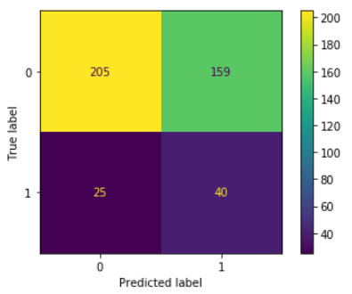

# Depression-Prediction-using-Financial-data

Depression is a mental state of feeling low and withdrawal from doing any activity. It affects the way of thinking, perception and focus of a person.
Often it is found that a person with depression is either experiencing sleep deprivation or is oversleeping. Feeling of despair and misery overcomes all other feelings for such persons. Sometimes such negative mindset leads to suicide. Duration of such experiences can be short or long term depending upon the recovery rate of such patients. Several factors like death of loved ones, accidents, personality disorder, side affects of certain medications, substance abuse like drugs or alcohol abuse and non-psychiatric illnesses like diabetes, cancer, Parkinson’s disease, stroke, etc. are responsible for triggering depression among people

The dataset has 23 columns including the target variable ‘Depression’. Total number of observations are 1429. We have taken into consideration factors/variables like age, gender, marital status, number of children, education, asset value, income, expenses, investments which are the possible attributes causing depression

The objective of our study was to forecast the tendency of developing depression using Logistic Regression, Random Forest and K-Nearest Neighbour machine learning models based on factors like age, gender, family, income status, demographics, etc. Thereafter we have evaluated the models by using Confusion Matrix which prints the Accuracy, Precision, F1 score, ROC and Recall score for model performance. Finally we conclude by selecting the best model with the highest accuracy score to predict development of depression in target patients.

On the conclusion, we can deduced the KNN model when used with the Bagging method produces the maximum accuracy on the testing data of 83% thought it is not the best performing model. In this problem, we want to maximize the correct predict in Class 1 (Depressed) to detect early possibilities of Depression. ADAboosted Logistic Regressor proves to perform better in predicting Class 1 better than other models.

